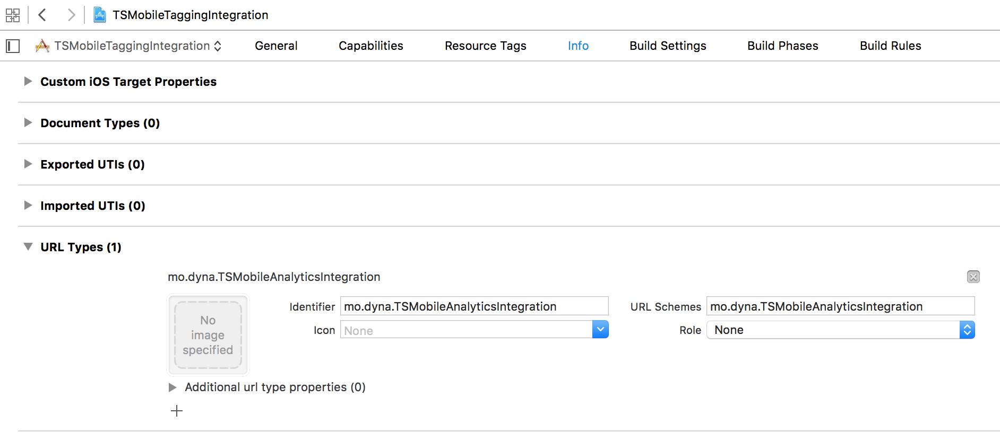

Developer's Guide - Kantar Sifo Mobile Analytics SDK for iOS
========


Overview
--------
This SDK will help you measure the usage of your iOS application using Kantar Sifo’s services.

### What's new?

Version 4 of this SDK is a major update with the following significant changes:

- Added support for WKWebView and removed UIWebView usages.

- Removed Shared Keychain functionality. 

- Moved documentation from PDF to GitHub markdown format.

- Added isWebViewBased parameter on initialization.

- Fixed retrieval of the Sifo panelist id, due to changes in iOS 13.
  **IMPORTANT:** This requires a new URL scheme, please see the section "Integrating with Sifo Internet app to tag Sifo Panelists", under "Setup".


### SDK contents

The SDK file contains three folders:

-   **Framework** folder with the TSMobileAnalytics.framework file that needs to be
included and linked with in your project.

-   **Documentation** folder with Developer's Guide and API Reference in HTML and GitHub markdown format.

-  **Samples** folder with code samples in Objective-C and Swift.

The lowest supported iOS version is iOS 9. For web view based applications it is recommended to use at least iOS 11, because the WKWebView cookie storage support is not available in earlier versions.


Sending Tags
------------
In order to measure traffic, your application needs to send HTTP-requests to a server provided by Codigo Analytics, using URLs following a specified pattern with information about your application.

Each of these HTTP-requests is called a “tag”. To get a good measure of the usage, your application should send a tag every time a new view or page of content is shown to the user. This tag should contain information about what content the user is seeing. For example when the user opens the application and its main view is shown, a tag should be sent – telling the server that the main view is displayed. When the user shows a list, an article, a video or some other page in your application, another tag should be sent, and so on.

The framework can help you with the whole process of sending them to the server. The only thing it needs from you is for you to tell it when a view has been shown, and what content it has. It also needs some information about your application, which is specified below:

### Available Tags

**Customer ID (CPID – 32 digits) - required**

The customer ID provided by Kantar Sifo or Codigo Analytics. This information will be included in the attribute called “cpid” in the tags sent to the server.

**Application name (type – max 244 characters) - required**

The name of your application – the framework will add platform before the name (i.e “APP\_IPHONE\_” or “APP\_IPAD\_”) so it does not have to be included in the name. This information will be included in the
attribute called “ref” in the tag.

**Category (cat - max 255 characters)**

The current category or name of the page that the user is browsing. This value tells us what the user is doing right now. If he is reading an article about sports in your application, the value might be “sports”. If he is browsing a set of football scores, the value might be
“sports/scores/football”. If the user is on the main view of the application, the value might be “MAIN” or similar. This information will be included in the attribute called “cat” in the tag.

**Content ID - optional (id – max 255 characters)**

The value of the current article, resource or content within the category that is being browsed. If the current category does not provide different content, this value is not needed. For example, if the user is
browsing a news article in your news application, the value should correspond to the identifier of the article used on your content server. If the user is reading article 123456 of an online newspaper, the value
of category could be “News/Article” and the value of Content ID would then be “123456”. This information will be included in the attribute called “id” in the tag.

**Content Name - optional (name – max 255 characters)**

The name of the current article, resource or content within the category that is being browsed.

### String encoding

Strings sent to the server will be encoded using UTF-8. If the String given to the framework contains characters that are not supported by this encoding, these characters will not be stored correctly in the
statistics.

### User identification across several applications

There are many restrictions regarding identifying a single user between several applications on the iOS platform. In previous versions of the SDK, shared keychains were used to achieve this. This is no longer possible due to privacy restrictions in recent iOS versions. 

Migration guide
--------

Follow this guide if you previously have been using a version of the SDK less than 3.0.

1.  Remove the TSMobileTagging.framework-file from your project.

2.  Locate the new .framework-file, you will find it in a folder called "Framework" in your distribution package.

3.  Add it to your project by dragging the file into your project navigator, drop in desired location.

4.  Replace the import of the old framework with the new, you will get a build error where this needs to be done.

5.  Replace your old init-call with the new one, like so:<br/>

`
[TSMobileAnalytics createInstanceWithCPID:@"CPID" applicationName:@"APPNAME"
trackPanelist:trackPanelist isWebViewBased:isWebViewBased keychainAccessGroup:nil];
`

6.  Replace calls to track events and/or page views, with corresponding calls for the new framework, like so:<br/>

`
[TSMobileAnalytics sendTagWithCategories:@[@"your", @"category/ies"]
contentName:@"yourOptionalContentName"
contentID:@"yourOptionalContentId"
completion:completionBlock];
`

7.  If you are syncing the framework with the Sifo Internet app, replace your framework call inside your application's openURL call, like so:<br/>

`
[[TSMobileAnalytics sharedInstance] application:application openURL:url options:options]
`

Other
-----

The framework is distributed as a static framework, with slices for ARM and Intel, for you to include in your iPhone project. The files contain a set of functions, many of them are optional to use – you basically only need to implement three methods to get the measurement to work.

The framework will take care of threading for you, so you do not need to think about running the code in a separate thread.


Setup
-----

### Importing the framework into your project

To use the framework, you add it to your iPhone application project.

You can do this the following way:

1.  Extract the framework zip file in any desired location.

2.  Right-click on the *Framework*-group in the Project Navigator
in Xcode.

3.  Select “Add Files to &lt;Your Project Name&gt;…”

4.  Browse to where you extracted the framework and select
*MobileAnalytics.framework*. Check the checkboxes for the targets that
should link to it and click “Add”.

5.  The targets that you added the framework to also needs to link with
*Security.framework*. You can verify that that is the case by going
to the *Build Phases* tab for the target you want to verify.

6.  If *Security.framework* is missing from the list of libraries to
link against you can add it by pressing the “+”-button and choosing
it from the list of system libraries in the sheet that is presented.


### Integrating with Sifo Internet app to tag Sifo Panelists

Panelist app integration is available to both WebView based apps and native apps. The purpose of this integration is to identify the user as a certain panelist. This is achieved by receiving a panelist Id string from the Panelist app, and setting that Id as a cookie in your app’s shared WKHTTPCookieStore. This communication is handled by setting some predefined URL schemes in your app.

To allow the framework to integrate with the Panelist app you need to implement a method in your app’s App delegate. In this method you then forward those calls to the framework to so it can save the data it needs in your apps user defaults database to track the panelist.
You also need to add your app’s bundle identifier as a custom URL scheme so that the Panelist app can find your app.


1. Add a custom URL scheme to your app that matches the bundle identifier of your application plus ".tsmobileanalytics"; for example, if your app bundle identifier is "se.nagonting", it should be "se.nagonting.tsmobileanalytics". You can find your app’s bundle identifier in the ”General” tab of your application’s target. You then enter this bundle identifier in all lowercase letters as a custom
URL scheme under the ”Info” tab for your application’s target, as shown in the second screenshot below.
<br/><br/>
Screenshot of the Xcode target ”General”-tab where will find your app
target’s *Bundle Identifier*.
<br/>


<br/><br/>
Screenshot of the Xcode target ”Info”-tab where you define custom
URL schemes:



<br/><br/>
2. While you're making changes in the info.plist, you might as well add some settings needed to allow that your app to open the Panelist app. The easiest way to do these changes, is to show the
version editor, by clicking the button with the top right of Xcode (see image below).


3. After the changes you've already made, paste in the following:
```
    <key>LSApplicationQueriesSchemes</key>
      <array>
        <string>se.tns-sifo.internetpanelen</string>
        <string>se.tns-sifo.sifopanelen</string>
    </array>
```
4. To have this custom URL scheme picked up by the framework you have to
implement the method - application:openURL:sourceApplication:annotation:
in your app’s delegate and forward it’s arguments to the same method as
implemented by the framework. At this point you already need to have
instantiated the framework with the
*createInstance* method as described above.

```Objective-C
- (BOOL)application:(UIApplication *)application
            openURL:(NSURL *)url
            options:(NSDictionary<UIApplicationOpenURLOptionsKey, id> *)options {
  return  [[TSMobileAnalytics sharedInstance] application:application openURL:url options:options];

SWIFT
use 
  func application(_ app: UIApplication, open url: URL, options: [UIApplicationOpenURLOptionsKey: Any] = [:]) -> Bool {
        return TSMobileAnalytics.sharedInstance().application(app, open: url, options: options)
    }

```

If you already implemented this method, you can use the *url* argument to differentiate which URL scheme that is responsible for the method getting invoked.

In this example the *url* parameter would be:
*mo.dyna.TSMobileAnalyticsIntegration:{panelist\_identifier}*

If you successfully implement the integration above the framework will store the panelist identifier in your apps user defaults database under the key “se.tns-sifo.cookiekey”.

It will use this identifier in a cookie set in your app’s NSHTTPCookieStorage. This will allow Kantar Sifo to track the panelist’s traffic on participating sites. The cookie is limited to domains used by Kantar Sifo.

For WebView based apps this is all that’s needed to integrate with the panelist tracking. These cookies are then sent for the JavaScript or image-loading tracking done on the webpages of your site. That said, you do not need to make any requests from your app like the ones native apps do by *sendTagWithCategories* etc.

**Please note that steps 1 and 2 are crucial for a successful implementation in a hybrid app. Further more please make sure that your CPID (required parameter) and other optional parameters do match the ones setup in the Sifo tags implemented by the webpage you wish to track.**

**Another note: The built-in support for WebView was previously limited to UIWebView. However, version 4.X of the framework now only supports WKWebView. The support for the deprecated library UIWebView has been removed.

5\. To test the integration with the “Sifo Internet” app please download it from the App Store. When you create a new instance of the framework with trackPanelist: set to TRUE, if so it automatically opens the “Sifo Internet" app to check if you are a logged in respondent. You should be redirected back to your own app.

The information about the Sifo application state is stored in the framework. If you now close your app fully and reopen it you should not be redirected to the Sifo Internet App. In approximately two weeks later we will check once more if the Sifo Internet app state has changed. If the above redirection works as described the Sifo Internet App integration is working correctly.


Code implementation
-------------------

### Basic functionality

To get started with the tagging, you only need 2 methods.

-   Use **createInstanceWithCPID:applicationName:trackPanelist:isWebViewBased:keychainAccessGroup:** to create an instance of the framework and specify application name and customer ID.

-   Use **sendTagWithCategories:contentName:contentId:completion:** to send a tag to the server when a view is shown in your application.

Implementation steps
---------------------

1.  Import the framework header &lt;TSMobileAnalytics/TSMobileAnalytics.h&gt; in your App’s delegate and any other class where you want to perform tagging.

2.  Turn on debug prints to see that the framework is working properly by calling the setLogPrintsActivated method as shown below. (this line can be removed once you have verified that the tagging is working properly)

3.  Initialize the framework by calling the createInstance method as shown below.<br/>
***In the App Delegate’s application:didFinishLaunchingWithOptions***<br/>
`
[TSMobileAnalytics createInstanceWithCPID:@"56d7728b318c4ae98963619ca1a2ec29" applicationName:@"mobil.sifo-test" trackPanelist:YES isWebViewBased:YES keychainAccessGroup:nil];


`<br/><br/>
…where cpid is a String holding your Customer ID and name is a String with the name of your application. The CPID must only contain alphanumeric characters and may not be longer than 32 characters. The application name may not be longer than 244 characters.<br/><br/>
It can also be a good idea to make sure that createInstance does not return nil, which means that something was wrong with your input data. If this happens you will also get an error print in the log, if log prints has set to activated.

4.  Now, use the following methods to send a tag:<br/><br/>
***In the viewWillAppear-method or any other place where your application displays a view or page that should be tagged:***
<br/><br/>

<code>
OBJECTIVE-C
[TSMobileAnalytics sendTagWithCategories:@[@"your", @"category/ies"]
                             contentName:@"yourOptionalContentName"
                               contentID:@"yourOptionalContentId"
                              completion:^(BOOL success, NSError *error) {}];

SWIFT							  
	TSMobileAnalytics.sendTag(withCategories: ["category-testios"], contentName: "", contentID: "123-contentID") { (success, error) in
	    if let tError = error {
	        // Handle error.
	        print("Error: \(tError.localizedDescription)")
	    }							  
</code>

… where category is an array of strings holding the current category or page that is being tagged, id is a String with the identifier of the current content, name is a String with the name of the current content (this function is available without this parameter). Maximum length of contentID, contentName and category is 255 characters, while the maximum length of extra is 100 characters.

The framework will now send a tag to the server with the information you provided, using a background thread.


Setup/Implementation checklist
------------------------------

1. Add you bundleIdentifier as a custom URL scheme. This is to make your app accessible for the Sifo Internet-app to perform a sync.
2. Implement -openUrl: in your appdelegate, forward the call to the framework.
3. Instantiate the framework with the createInstance-method. Make sure you use the correct parameters.
4. Download the Sifo Internet application from the App Store, make sure the syncing works as expected.

Additional steps for a native implementation
--------------------------------------------

1. Implement the sendTag method everywhere you wish to send a tag through the framework.

Options
-------

If you want to use a category structure
with subcategories, such as “News&gt;Sports&gt;Football”, you populate the categories array with each category in descending order.

`
[TSMobileAnalytics sendTagWithCategories:@[@"News", @"Sports", @"Football"]
contentName:@""
contentID:@""
completion:^(BOOL success, NSError *error) {
}];
`

…where categories is an array of Strings specifying the category
structure. A maximum of 4 categories is allowed in the structure, and
their names must not be longer than 62 characters each.

Identifying a single user
-------------------------
An UUID string will be persisted locally, to your app's NSUserDefault storage. This value will be sent as a query parameter in your tag request, to identify request from one user.

Frequently asked questions
-------------------------
**Q:** My app does not sync with the Sifo Internet app. Why?

**A:** There can be a couple of things wrong. Please make sure that:
-   You have registered your app's bundle identifier as a custom URL scheme in your target's "Info"-tab, under "URL Types".
- You have implemented the openURL:-method in your app's application delegate, and forwarded that call to the framework. For more thorough information and a step by step-guide, please read the section "Integrating with Sifo Internet app to tag Sifo Panelists", under "Setup".


Additional information
----------------------

For additional information about what can, or can't, be tagged please reach out to Kantar Sifo, contact information to be found in the end of this document.

### Implementation check

Before the app is submitted to App Store, tests need to be performed according to instructions provided by Kantar Sifo. Please contact Kantar Sifo.

### Update strategy

The framework is compatible with iOS 9 or above. 
Updates of the framework will be necessary to fix bugs, add features, handle changes on the servers or the platform etc. For this reason we want to make updating of the framework as easy and seamless as possible.

When a new version of the framework is the delivered, it should be possible to simply replace the folder containing the framework code and then update the software project. The update will always be kept backward-compatible as long as it’s possible, so that your old code will still work after the update.

To keep updating as seamless as possible, it is important that you:

-   Keep the framework code separated from the application code, in a separate folder in the project.

-   Inform us as soon as you find something that should be changed or improved.

-   Inform us as soon as you find a bug, memory or performance issue.


License information
-------------------
This source files are released under an MIT license:


Contact information
-------------------

Please send any questions or feedback to:

[*peter.andersson@kantar.com*](mailto:peter.andersson@kantar.com)
<br>+46 (0)701 842 372

and/or

[*info@kantarsifo.com*](mailto:info@kantarsifo.com)
<br>+46 (0)8 507 420 00
